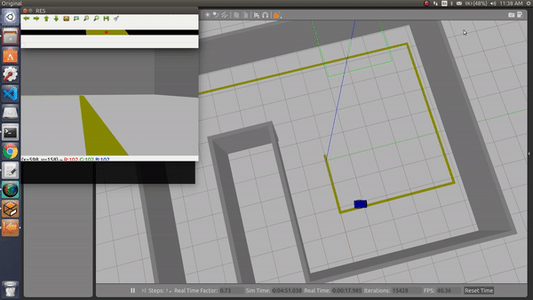
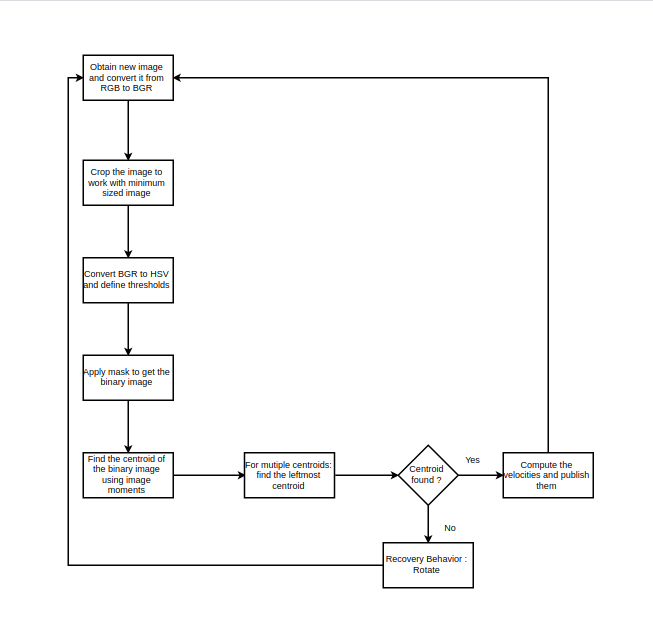

# Line Follower Maze Solver Robot using OpenCV on ROS


1. Simple Line Follower :
```
roslaunch line_maze_ros line_follower_world.launch
rosrun line_maze_ros start.py
```


2. Maze Solver - I have used left-hand rule algorithm to solve the maze.
```
roslaunch line_maze_ros line_follower_maze_world.launch
rosrun line_maze_ros start_multiple.py
```


Watch the full video [here](https://www.youtube.com/watch?v=i0bQdSUhcpE)


